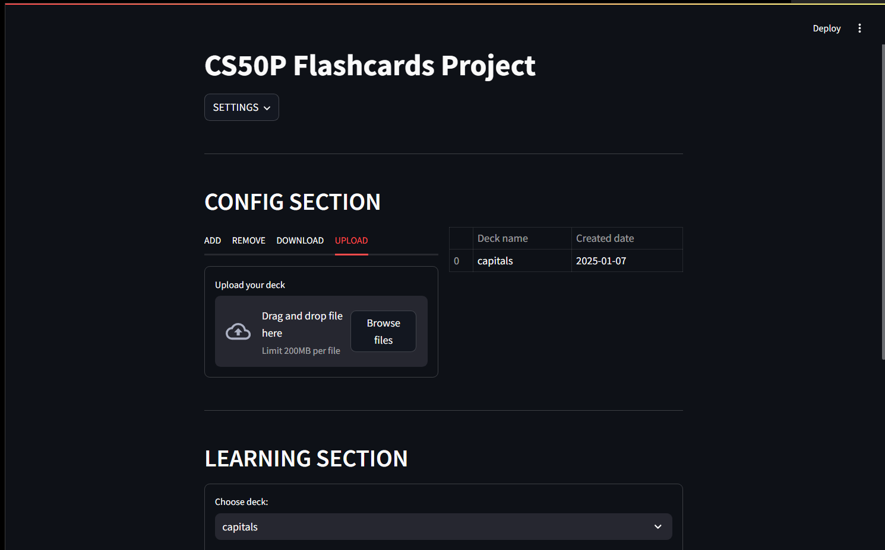

# 🎩 Flashcard 50

<div>
    
</div>

This is a flashcard learning web app created to enable users in creating, managing, and studying flashcards. It uses the Streamlit-driven user-friendly interface to create flashcard decks, add cards to or remove them from decks, and study a deck of cards. Also, the user will be able to upload/download flashcard decks in order to share and keep them for personal use. Students who want to improve their learning by means of digital flashcards will also be able to do it with the help of this web appapp.

## Getting Started

1. Folk the repository

2. Clone the repository
```bash
git clone https://github.com/haolamnm/flashcard-50.git
```

3. install the required packages
```bash
pip install -r requirements.txt
```

4. Run the app
```bash
streamlit run app.py
```

## How to use

After you successfully run the app, you will see the home page of the app. Enter neccessary information to create your profile. Then create a new deck. Add cards to the deck and study them.

If you want to share the deck with others, you can download your own deck as a CSV file and share it. Other users can upload the CSV file to their own profile to study the deck.

For more information, you can watch the demo video below. [YouTube Link](https://www.youtube.com/watch?v=Q8IJsduPAsE).

## Technical Stack

- **Python**: Main programming language for the app.
- **Streamlit**: Open-source app framework for quick and friendly UI.
- **Pandas**: Data manipulation library.

For now, the app is only available for local use.

## For Developers

If you want to contribute to the project, you can create a pull request. If you have any questions, you can contact me via email.

Email: [haolamnm.work@gmail.com](mailto:haolamnm.work@gmail.com).

GitHub: [@haolamnm](https://github.com/haolamnm).

LinkedIn: [@haolamnm](https://www.linkedin.com/in/haolamnm/).

---
